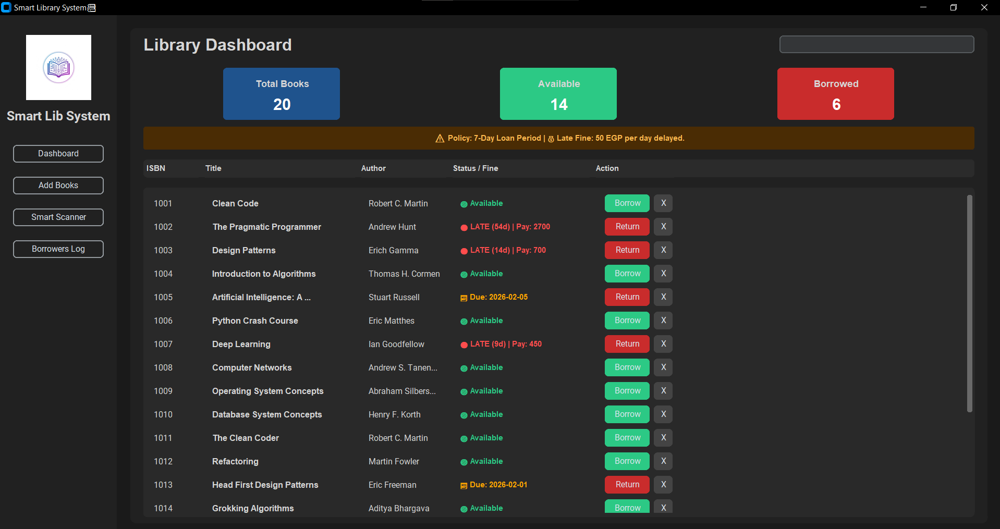
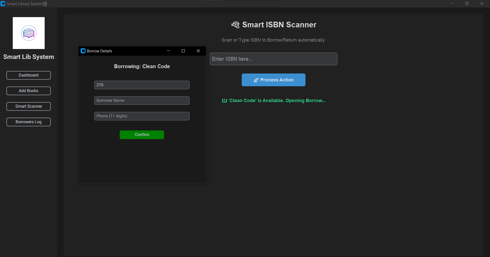

# 📚 Smart Library Management System Pro


> **A modern, intelligent, and dark-themed desktop application for managing library operations with financial tracking and smart automation.**

---

## 📸 Screenshots

| Interactive Dashboard | Smart Scanner & Audit |
|----------------------|-----------------------|
|  |  |

> ⚠️ Replace the image paths with your actual screenshots.

---

## 🚀 Key Features

This project goes beyond basic CRUD operations and simulates a **real-world library business system**:

- 🔫 **Smart ISBN Scanner**
  - One scan (or Enter key) automatically decides:
    - Borrow a book if available
    - Return a book if already borrowed

- 💰 **Financial Logic Engine**
  - Automatic overdue fine calculation (**50 EGP per day**)
  - Prevents book return until fines are confirmed paid
  - Full financial history stored in audit logs

- 🎨 **Modern Dark UI**
  - Built with **CustomTkinter**
  - Clean, professional, and eye-friendly dark theme

- 🛡️ **Robust Validation System**
  - Prevents duplicate ISBN entries
  - Validates phone numbers and user input
  - Protects borrowed books from accidental deletion

- 📊 **Audit Logging**
  - Permanent transaction history
  - Logs all borrow/return operations with:
    - Timestamp
    - User details
    - Book details

- 🔢 **Auto-Increment User IDs**
  - Automatically generates unique borrower IDs

---

## 🛠️ Tech Stack

- **Programming Language:** Python 🐍
- **GUI Framework:** CustomTkinter
- **Data Storage:** JSON (Lightweight & portable)
- **Image Handling:** Pillow (PIL)
- **Design Concepts:**
  - Object-Oriented Programming (OOP)
  - MVC Architecture
  - File Handling
  - Algorithmic Logic

---

## 📂 Project Structure

```text
Smart-Library-System/
│
├── main.py              # Application entry point
├── system.py            # Backend logic & controller
├── gui.py               # CustomTkinter GUI
├── book.py              # Book model
├── borrow_record.py     # Borrow transaction model
│
├── library_data.json    # Books database
├── borrow.json          # Borrow & return logs
│
├── logoo.jpg            # Application logo
├── requirements.txt     # Dependencies
└── README.md            # Documentation
```

---

## ⚡ Quick Start

### 1️⃣ Clone the Repository
```bash
git clone https://github.com/YOUR_USERNAME/Smart-Library-System.git
cd Smart-Library-System
```

### 2️⃣ Install Dependencies
```bash
pip install -r requirements.txt
```

### 3️⃣ Run the Application
```bash
python main.py
```

---

## 🧠 How It Works

### 🔍 Smart Scan Logic
1. Enter ISBN
2. System checks book status:
   - **Available** → Opens Borrow Form (auto-fills next User ID)
   - **Borrowed** → Checks due date → Calculates fine → Requests payment → Returns book

### 💾 Data Persistence
- All data is saved instantly to `.json` files
- Close the app anytime — data and fines remain محفوظة ✔️

---

## 👤 Author

**Eng. Ahmed Ayman**  
**AI & Data Science Engineer**

- 🔗 LinkedIn: https://www.linkedin.com/in/ahmed-ayman-10b966292  
- 💻 GitHub: https://github.com/Eng-AhmedAyman

---

## 📄 License

This project is licensed under the **MIT License**.

---

🚀 *Built with passion and Python by Ahmed Ayman.*
