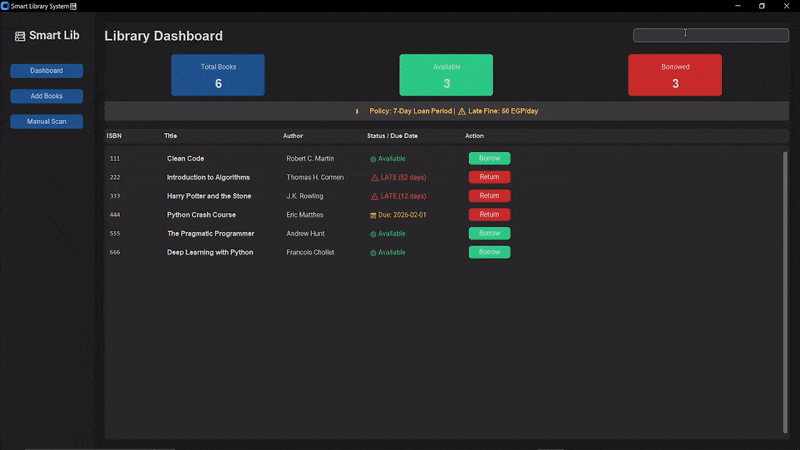

# 📚 Smart Library Management System


> A modern, modular Desktop Application for Library Management, built with Python and Object-Oriented Programming principles.

---

## 📸 Preview



---

## 🚀 Overview

**Smart Library System** is a desktop application that simulates a real-world library environment.  
Unlike basic CRUD systems, this project implements real **business logic** for book circulation, **automated fine calculation**, and a **modern dark-mode GUI**.

It demonstrates practical usage of:

- Object-Oriented Programming (OOP)
- Modular Architecture
- MVC-inspired Design
- Data Persistence using JSON

---

## ✨ Key Features

- 🎨 **Modern Dark UI**  
  Built with `CustomTkinter` for a clean and eye-friendly user experience.

- 🔍 **Dynamic Search**  
  Real-time filtering by **Title**, **Author**, or **ISBN**.

- 🧠 **Smart Library Logic**
  - Auto-generated due dates (7-day borrowing policy)
  - Automatic fine calculation (50 EGP per late day)
  - Visual status indicators:
    - 🟢 Available
    - 🟠 Borrowed
    - 🔴 Late

- 💾 **Data Persistence**  
  All records are stored in `library_data.json` — no external database required.

- 📂 **Modular Code Structure**  
  Clean separation between GUI, Logic, and Data Models.

---

## 🛠️ Tech Stack

| Technology    | Description                  |
| ------------- | ---------------------------- |
| Python        | Core programming language    |
| CustomTkinter | GUI Framework                |
| JSON          | Data Storage                 |
| Datetime      | Due date & fine calculations |
| OOP           | Project Design Pattern       |

---

## 📂 Project Structure

```
Smart-Library-System/
│
├── main.py             # Application Entry Point
├── gui.py              # Frontend (CustomTkinter UI)
├── system.py           # Backend Controller (Borrow/Return Logic)
├── book.py             # Data Model (Book Class)
├── library_data.json   # JSON Database File
└── README.md           # Project Documentation
```

---

## 💻 Installation & Usage

### 1️⃣ Clone the repository

```bash
git clone https://github.com/Eng-AhmedAyman/Smart-Library-System.git
cd Smart-Library-System
```

### 2️⃣ Install dependencies

```bash
pip install customtkinter
```

### 3️⃣ Run the application

```bash
python main.py
```

---

## 🎯 Future Improvements

- User authentication system
- Admin & Librarian roles
- Export reports to PDF
- SQLite database integration
- Online book reservation system

---

## 👤 Author

**Ahmed Ayman**  
AI & Data Science Engineer

🔗 GitHub: [https://github.com/Eng-AhmedAyman]  
🔗 LinkedIn: [www.linkedin.com/in/ahmed-ayman-10b966292]

---

## 📄 License

This project is licensed under the **MIT License** — feel free to use and modify it.

---

⭐ If you like this project, don't forget to give it a star on GitHub!
